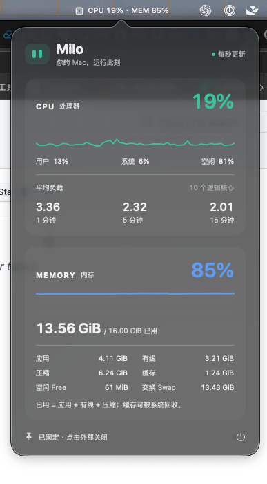

# Milo

一个安静待在 macOS 菜单栏里的性能监控工具。SwiftUI 绘制详情，AppKit 管理菜单栏与悬停交互，无第三方依赖。

<p align="center">
  
</p>

Milo 常驻菜单栏，随时显示 CPU 与内存使用率；悬停即可查看平均负载、内存分类和最近采样趋势。

## 运行

1. 使用 Xcode 16 或更新版本打开 `Milo.xcodeproj`。
2. 选择 **Milo → My Mac**，按 **⌘R**。
3. 菜单栏出现 `CPU …% · MEM …%`。没有主窗口，也不占 Dock。

最低支持 macOS 14，兼容 Apple Silicon 和 Intel。工程默认使用本机 ad-hoc 签名，无需配置开发者账号；对外分发时需另行配置正式签名和公证。

鼠标停留约 0.25 秒展开详情；可以把鼠标移入面板继续查看。移出后自动关闭。点击菜单栏项目固定面板，再次点击或点击外部关闭；固定时也可按 Esc 关闭。面板右下角电源按钮退出 Milo。

面板底部的透明度滑杆支持 0–100%，默认 92%，拖动时实时改变毛玻璃层强度；设置会自动保存。太阳 / 月亮按钮可切换日间与夜间样式：日间使用 Aqua 外观，夜间使用 Dark Aqua 外观，选择也会自动保存。毛玻璃底层使用 AppKit 的 `.popover` 材质，因此颜色不是固定黑色，会随当前样式显示为深灰或浅灰。

## 指标口径

- **CPU 使用率**：`host_statistics(HOST_CPU_LOAD_INFO)` 两次采样间的 tick 差值，用户态（含 nice）与系统态之和；所有核心归一到 0–100%。启动和唤醒后的首个样本显示 `—`，等待下一次采样。
- **Load Average**：`getloadavg` 的 1、5、15 分钟系统平均负载，不是百分比，也不是瞬时使用率。显示逻辑核心数供参考。
- **已用内存**：应用 + 有线 + 压缩。应用为 `(internal_page_count - purgeable_count) × pageSize`；压缩使用实际物理页数，不使用压缩前大小。
- **Free**：`(free_count - speculative_count) × pageSize`。
- **缓存**：`(external_page_count + purgeable_count) × pageSize`。speculative 同时包含在 free_count 和 external_page_count 中，从 Free 扣除后只在缓存计入一次。
- **Swap**：`sysctlbyname("vm.swapusage")` 的已用交换空间，与物理内存单独显示。
- 内存来自 `host_statistics64(HOST_VM_INFO64)`，使用本机页大小，容量标注二进制单位 GiB / MiB。数据是系统计数器的近似快照，可能与活动监视器因刷新时机、统计口径不同而有小幅差异；内存使用率不代表内存压力。

采样约每秒一次，保留最近 60 次内存中的趋势数据；睡眠时暂停，唤醒时重建 CPU 基线。不启动 shell 子进程，不保存历史，不访问网络，不需要辅助功能或录屏权限。悬停检测仅在面板打开期间使用额外定时器。

参考：[Apple VM 统计结构](https://developer.apple.com/documentation/kernel/vm_statistics64_data_t)、[XNU 页计数说明](https://github.com/apple-oss-distributions/xnu/blob/main/osfmk/mach/vm_statistics.h)、[NSPopover](https://developer.apple.com/documentation/appkit/nspopover)。

## 验证

```sh
rtk proxy xcodebuild -project Milo.xcodeproj -scheme Milo -configuration Debug -derivedDataPath .build build
rtk proxy xcodebuild -project Milo.xcodeproj -scheme Milo -configuration Debug -derivedDataPath .build test
```

自动化测试覆盖 CPU 差值、计数器回绕、4K / 16K 内存页、缓存去重、不可用状态，以及真实本机采样。图形界面还应检查悬停、点击固定、外部点击 / Esc 关闭、透明度拖动、日间 / 夜间切换和睡眠唤醒。

第一版不含登录启动、进程排行、网络或磁盘监控。

## 发布

采用免费的 ad-hoc 签名，不进行 Developer ID 签名或 Apple 公证。安装者需自行决定是否信任应用，首次打开的操作说明见各版本 Release。

更新工程的 `MARKETING_VERSION` 和 `CURRENT_PROJECT_VERSION`，在 `docs/releases/<版本>.md` 写好发布说明，提交并推送后，在该提交上创建并推送 `v<版本>` 标签。GitHub Actions 会运行测试、构建 Intel / Apple Silicon 通用应用、生成含 Applications 快捷方式的 DMG 和 SHA-256 文件，并创建 GitHub Release。标签版本必须与应用版本一致。

发布工作流使用仓库自带的 `GITHUB_TOKEN`，无需个人 Token 或 Apple 证书。附件上传完毕后才公开 Release；失败时请检查 Actions 日志，若留下草稿，可在草稿中继续处理。
